

## 4.1. Strategic-Level Attribute-Driven Design
### 4.1.1. Design Purpose

## 4.1.2. Attribute-Driven Design Inputs.
### 4.1.2.1. Primary Functionality (Primary User Stories).

### 4.1.2.2. Quality attribute Scenarios.
### 4.1.2.3. Constraints

### 4.1.3. Architectural Drivers Backlog

### 4.1.4 Architectural Design Decision
### 4.1.5. Quality Attribute Scenario Refinements.

## 4.2. Strategic-Level Domain-Driven Design.

### 4.2.1. EventStorming.
Se abordó un enfoque colaborativo y visual que permitió modelar el contexto del dominio. Se exploraron las etapas de Candidate Context Discovery, Domain Message Flows Modeling y la creación de Bounded Context Canvases.

#### Unstructured Exploration
Se realizó la fase inicial en la que se exploraron ideas, conocimientos sobre el dominio del negocio. Así, se obtuvo las bases para el modelado de las siguientes etapas.

  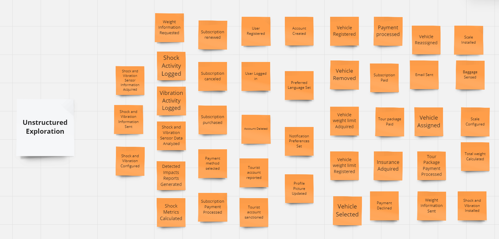

#### Pain points
Se identificaron las áreas problemáticas para la colaboración de sus soluciones y la implementación de mejoras que contribuyeron al flujo de trabajo.

  

#### Timelines
Hemos creado y gestionamos múltiples "timelines" para rastrear y coordinar nuestras actividades. 

  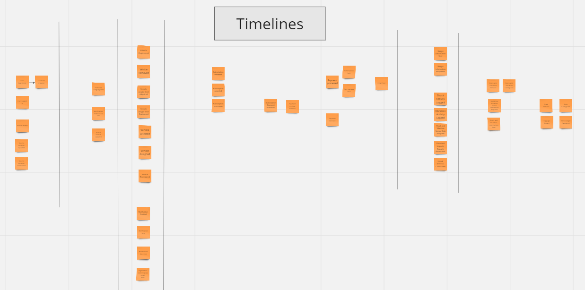

#### Pivotal points
Identificamos diversos "pivotal points" en nuestro proyecto para nuestra estrategia para alcanzar nuestros objetivos de manera más efectiva.

  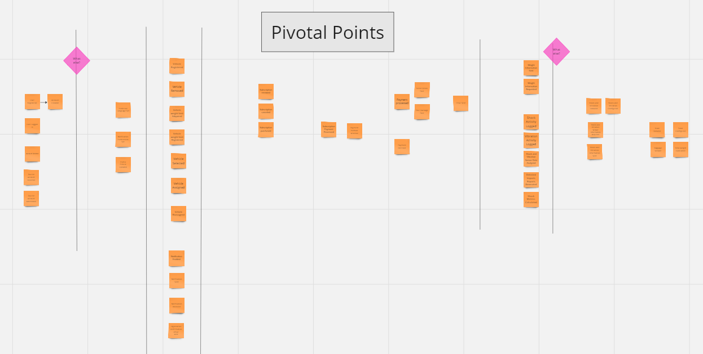

#### Commands
Estos jugaron un papel fundamental en la interacción y control de nuestro sistema al lograr las funcionalidades deseadas de manera eficiente.

  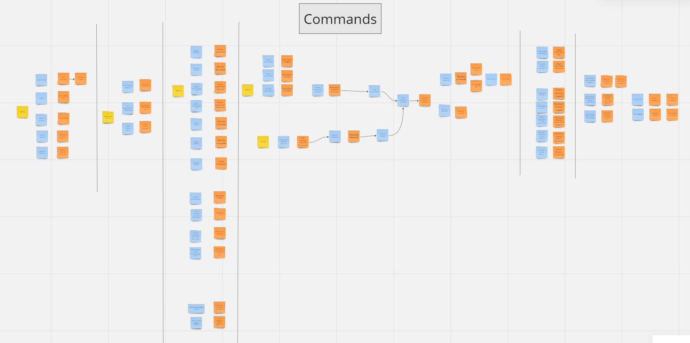

#### Policies
Hemos desarrollado y aplicado diversas "policies" en nuestro sistema para establecer reglas en nuestras operaciones y procesos.

  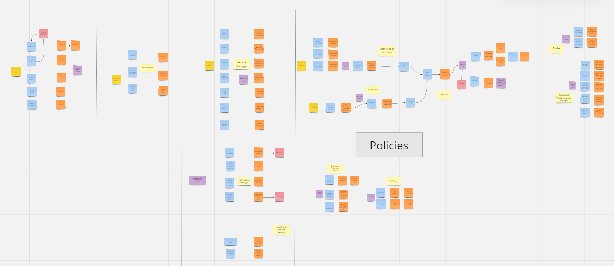

#### Read Models
Se gestionaron varios los "read models" en nuestro sistema para proporcionar vistas optimizadas de nuestros datos almacenados.

  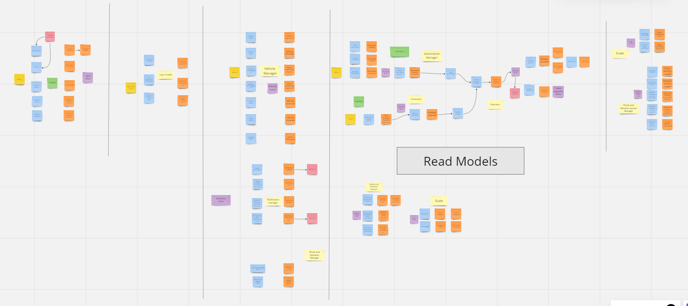

#### External Systems
Se identificaron los sitemas externos necesarios para la implementación de nuestro proyecto. Estos nos prooveran fuentes externas de datos o servicios.

  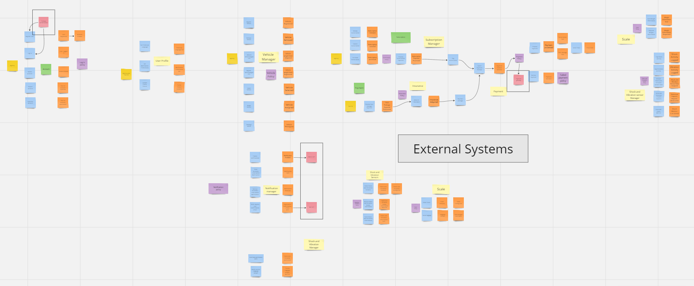

#### Aggregates
Se analizó cuáles son las entidades y conceptos que tienen un significado específico en el contexto del dominio.

  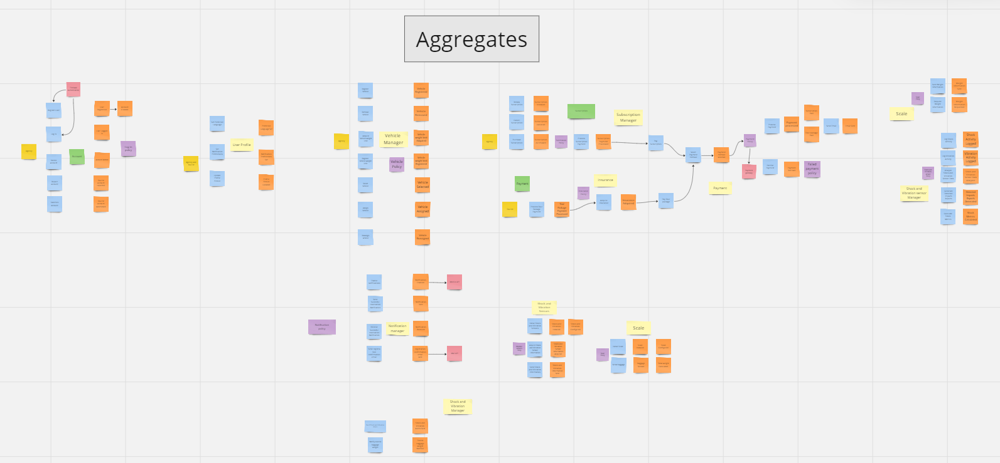

#### Bounded Contexts
Hemos identificado varios "bounded contexts" en nuestro proyecto para delimitar claramente las áreas funcionales y definir límites precisos entre los distintos componentes del sistema.

  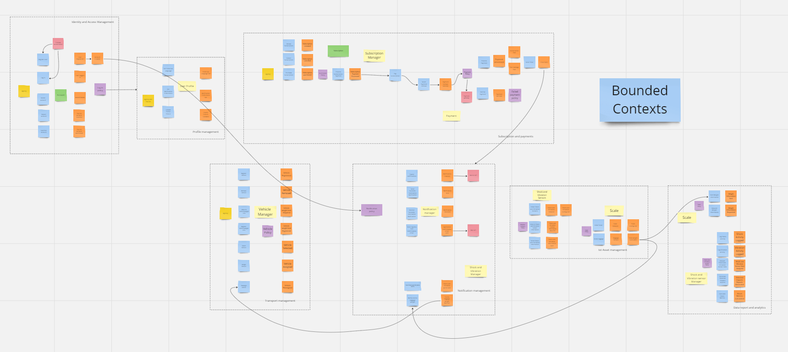

Link de EventStorming: https://miro.com/app/board/uXjVKX3-eW8=/?share_link_id=683824060622

### 4.2.2. Candidate Context Discovery.
Empleando la metodología de eventstorming con enfoque en la técnica de "start-with-simple", utilizamos la línea de tiempo para identificar posibles candidatos para nuestro contexto delimitado, los cuales son los siguientes:

#### Profile management
En este Bounded Context están los eventos y comandos relacionados a la gestión del perfil de nuestros dos tipos de usuarios: agencias de viajes y turistas. Asismismo, se encuentran los eventos de configuraciones generales de nuestras aplicaciones.

  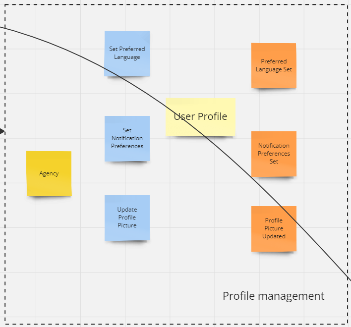

#### Identity and Access Management
En el presente Bounded Context están los comandos que están relacionados a la gestión de la autenticación de los usuarios en nuestras aplicaciones web y móvil. En este se detalla que usaremos un sistema externo llamado Firebase Authentication para nuestras dos aplicaciones.

  

#### Iot Asset management
Para este Bounded Context, nos enfocamos en crear los comandos que serán útiles para el mantenimiento de nuestros dispositivos Iot, tales como: Schock and Vibration Sensors and Smart Scales.

  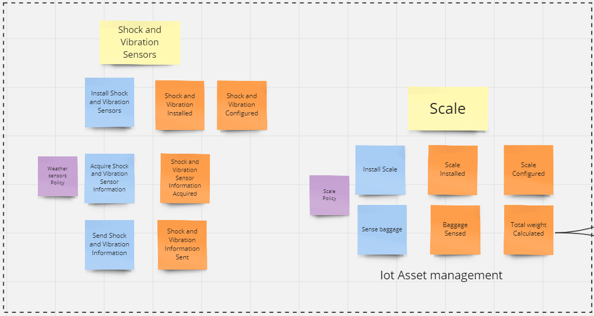

#### Notification management
En este Bounded Context están esencialmente los eventos y comandos para la gestión de notificaciones, ya sea por correo o a los dispositivos móviles de nuestros usuarios.

  

#### Subscription and payments
En este Bounded Context, se empleará un sistema externo de Pasarela de Pagos para realizar los pagos de las suscripciones y los paquetes turísticos seleccionados que deben abonarse. También, están los comandos para el mantenimiento de las subscripciones que los usuarios agencias de tours adquirirán.

  

#### Tour Package Management
En el presente Bounded Context, los usuarios agencias de viaje podrán crear, modificar y eliminar los paquetes turísticos que asociarán a los vehículos.

  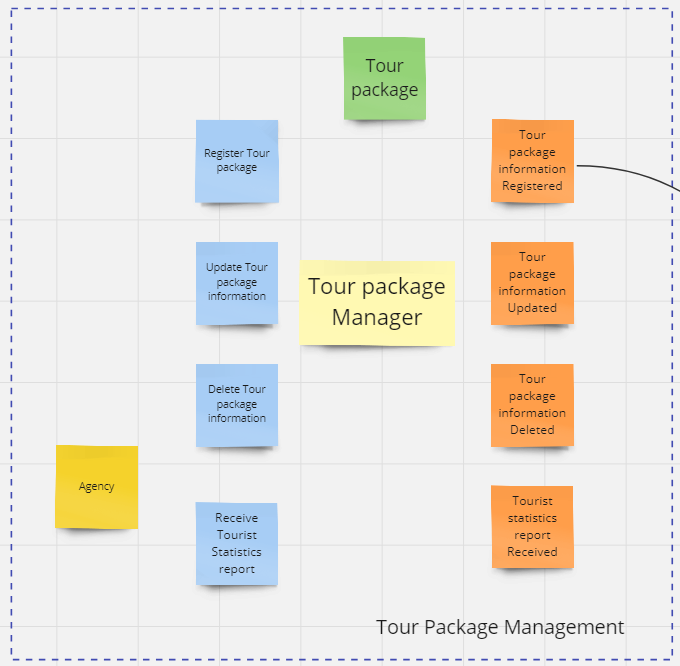

#### Transportation Management
En el presente Bounded Context, los usuarios agencias de viaje podrán crear, modificar y eliminar vehículos y asignarlos para cada tour registrado en la aplicación web. De igual manera, podrán visualizar la información de los transportes relacionada con el tour.

  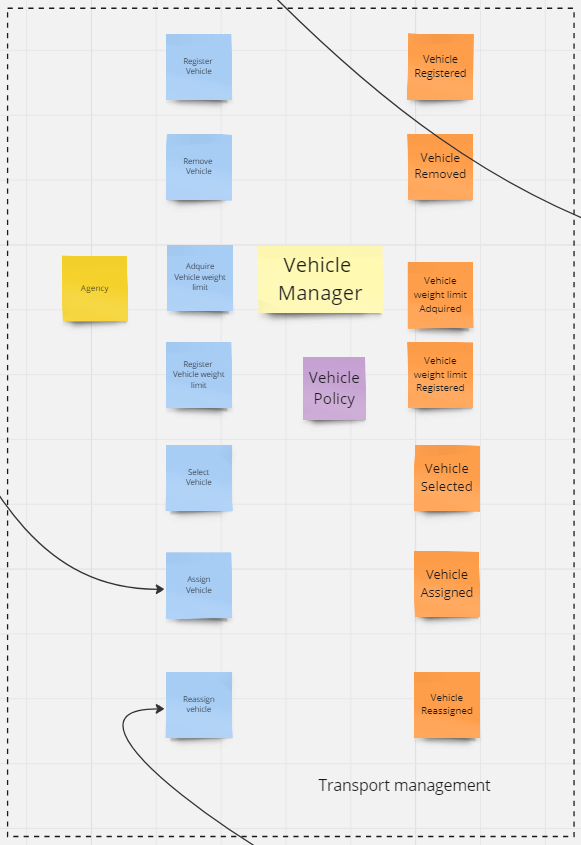

#### Data report and analytics
El Bounded Context "Data Report and Analytics" desempeña un papel fundamental en el análisis y la interpretación de datos tales como las reasignaciones de vehículos por exceso de peso de equipaje, satisfacción de los turistas a los paquetes turísticos, reportes sobre la cantidad de anomalías del clima de los lugares de los tours, entre otros.

  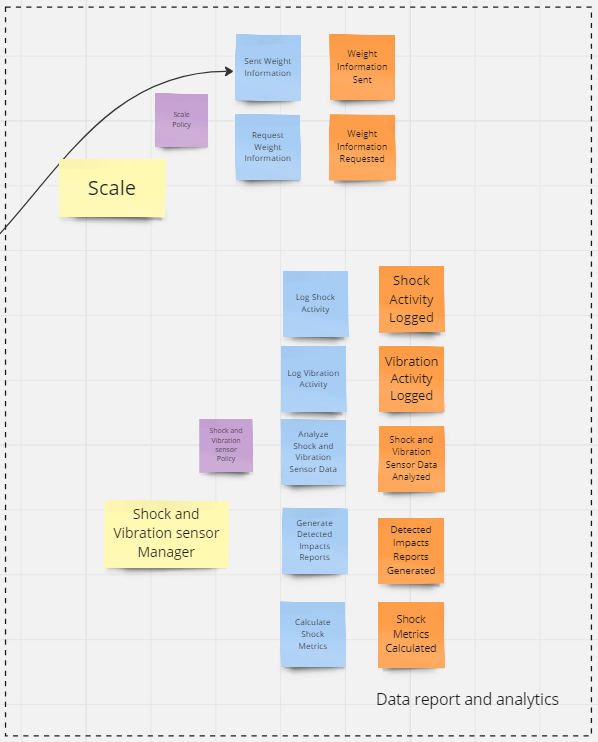

### 4.2.3. Domain Message Flows Modeling.
Durante este procedimiento, se detectaron los participantes, mensajes que se comparten y se delinean en las corrientes de información que enlazan estos componentes.

#### Scenario: Registering in the app
En el siguiente flujo se muestra cómo nuestros usuarios, tanto turistas como agencias, pueden registrarse en nuestra aplicación. Primero, pasarán por nuestro aplicación web, que registrará los datos requeridos en un sistema externo, respectivamente. Finalmente, recibirán una notificación a través del correo electrónico.

  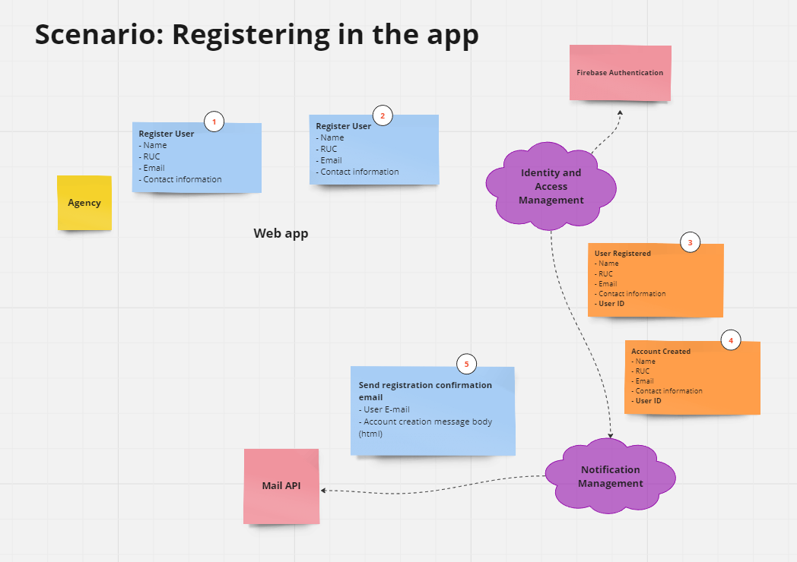

#### Scenario: Register a tour package
En este escenario, la agencia registra un paquete turístico, y nuestro sistema se encarga de almacenarlo en la base de datos con un ID para facilitar su identificación en el futuro de manera sencilla.

  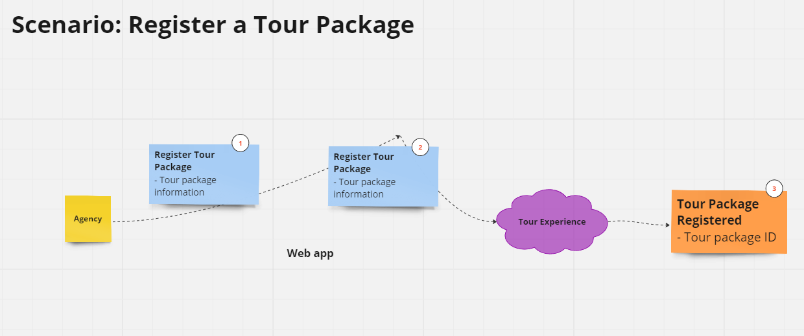

#### Scenario: Pay a Subscription
En este escenario, las agencias utilizan nuestra aplicación web para suscribirse a uno de nuestros planes. Cuando desean realizar el pago, nuestro sistema consulta el estado del mismo a través de un sistema externo. Una vez confirmado el pago, se asigna la suscripción a su cuenta. Además, se notificará a la agencia sobre el estado final de la compra.

  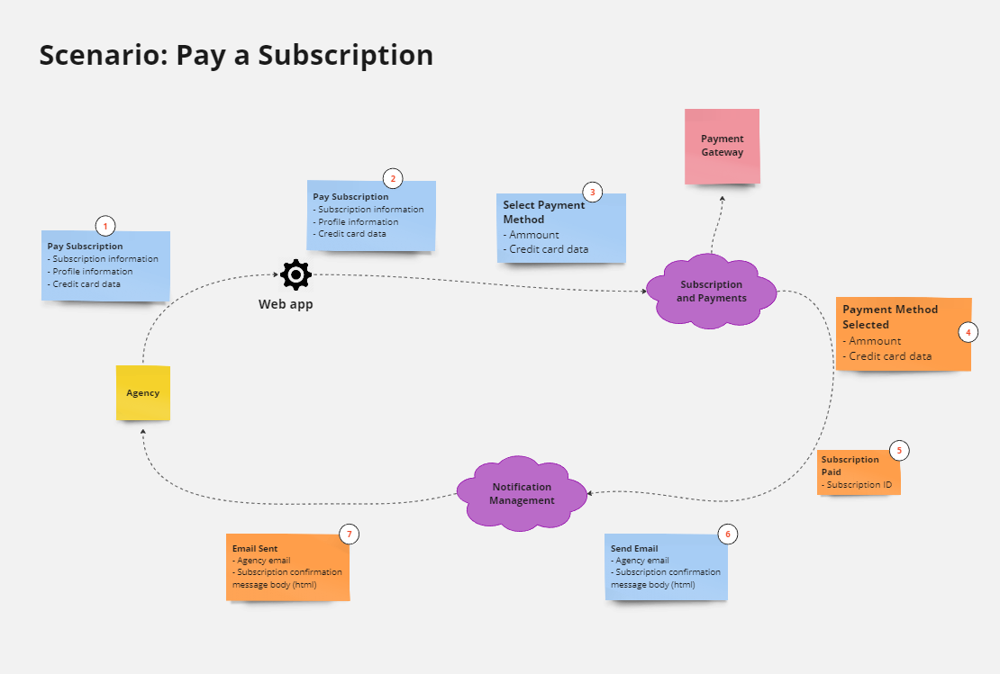

#### Scenario: Register a Vehicle
En este escenario, las agencias registran un medio de transporte utilizando nuestra aplicación web. El sistema se encarga de realizar las asignaciones correspondientes, lo que permite una gestión eficiente de los recursos de transporte disponibles para satisfacer las necesidades de los viajes turísticos.

  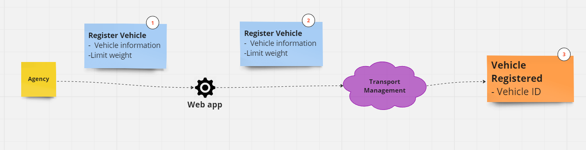

#### Scenario: Assign a vehicle for a Tour Package
En este escenario, se describe el proceso en el cual las agencias de viaje, utilizando nuestra aplicación web, asignan un medio de transporte, previamente registrado, a un paquete turístico. Esta asignación facilita la planificación y organización de los viajes, garantizando que el sistema tenga la información de los vehículos asignados y se pueda reorganizar.

  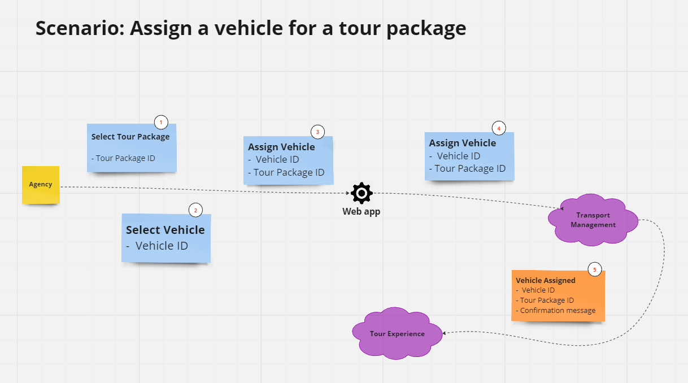

#### Scenario: Reassign a vehicle for excess weight limit
En este escenario, se muestra el flujo cuando a través de nuestros dispositivos IoT se detecta un exceso de peso que supera el límite permitido para el vehículo asignado. Después de esta detección, se notifica a la agencia mediante nuestra aplicación web, y finalmente se procede a la reasignación de un vehículo de transporte para ese paquete turístico.

  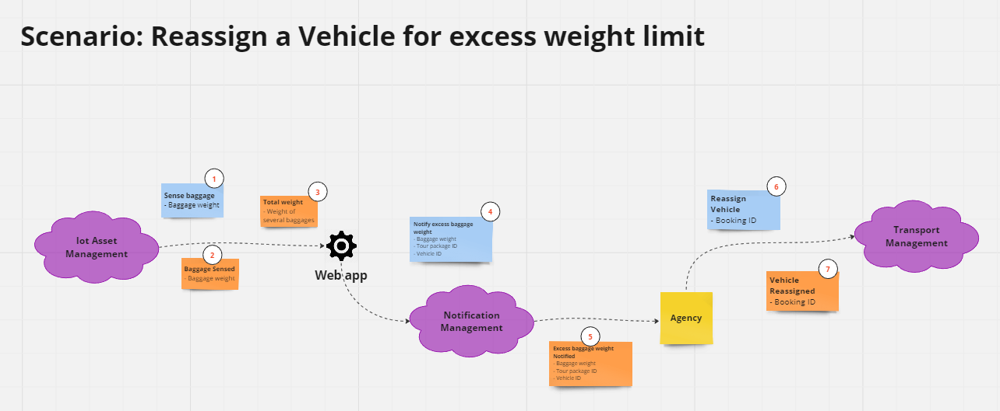

#### Scenario: Notify shock and vibration alert
Cuando alguno de los sensores colocados en los equipajes de los vehículos detecta una anomalía, ya sea impacto o mucha vibración, se envía una alerta a la agencia.

  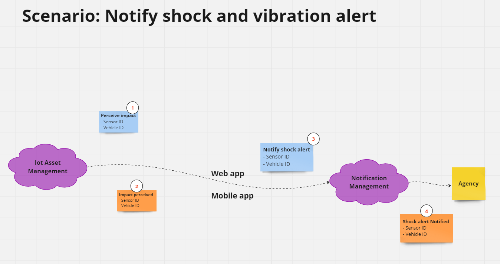

### 4.2.4. Bounded Context Canvases.

#### Data Report and Analytics
En este Canvas se obtendrá y analizará la información que devuelva los dispositivos Iot, ya sean las balanzas inteligentes, sensores. Este Bounded Context estará relacionado con los Bounded Context Iot Asset Management y Notification Management.

  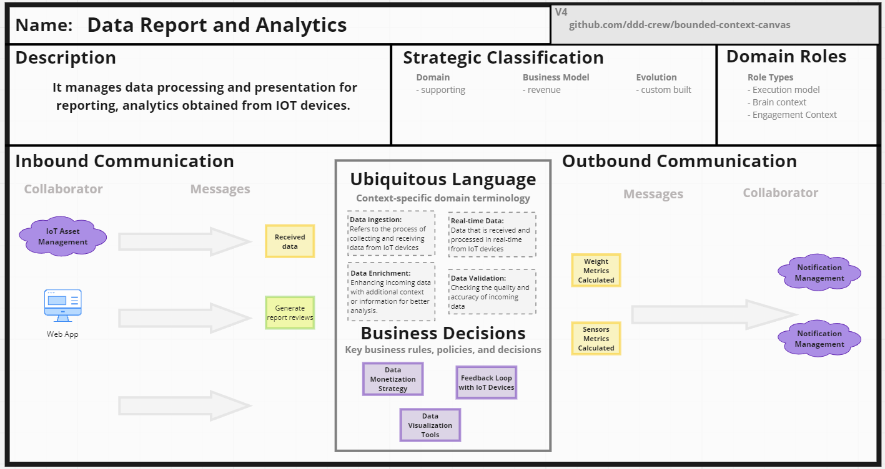

#### IoT Asset Management
La siguiente imagen corresponde al IoT Asset Management Bounded Context Canvas. Se puede observar que la información proporcionada de los dispositivos Iot se envía al Bounded Context de Notification Management.

  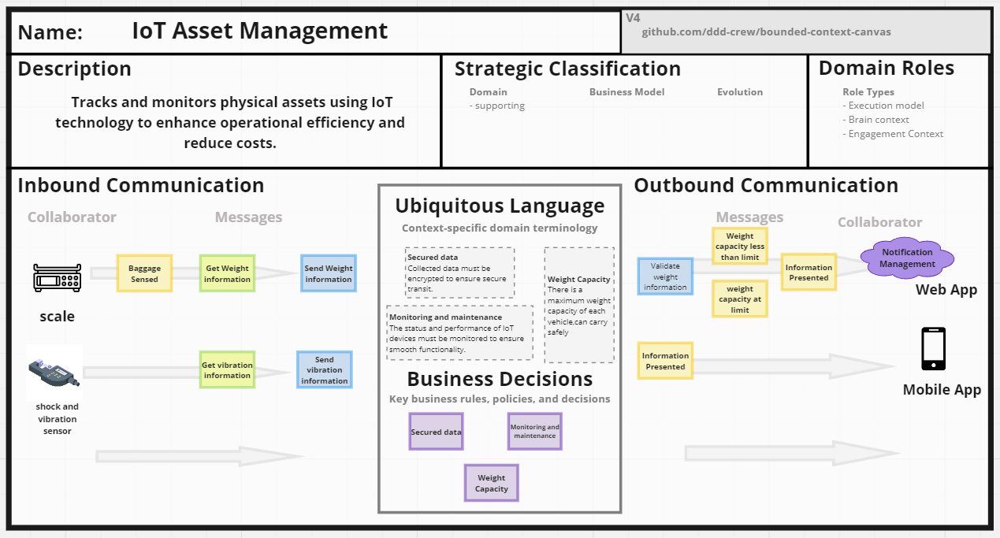

#### Identity And Access Management
En el siguiente Canvas, describe la comunicación que usaremos con los sistemas externos de autenticación para el registro e ingreso de los usuarios a nuestras aplicaciones web y móvil. Este Bounded Context estará relacionado con los Bounded Context Profile Management y Notification Management.

  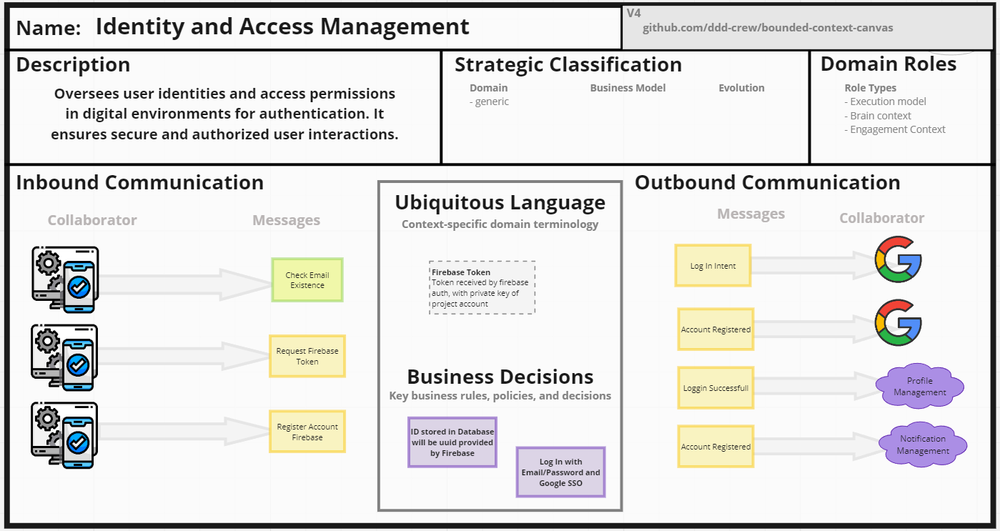

#### Subscription and payments
La siguiente imagen corresponde al Subscription and payments Context Canvas. Este gestiona la información de la compra de las subscripciones de las agencias en la aplicación web.

  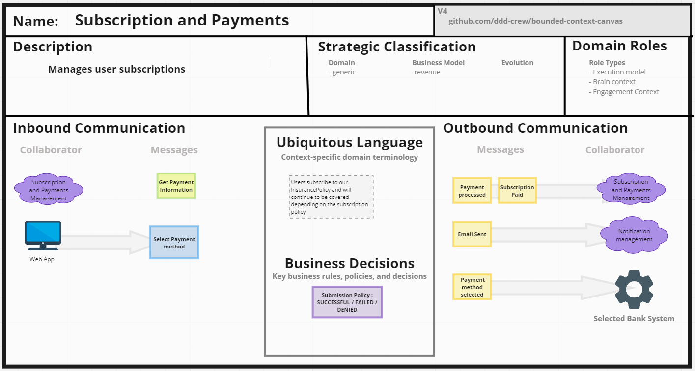

#### Notification Management
En este Bounded Context Canvas, se puede visualizar la comunicación que tendrá con la mayoría de Bounded Context. Este estará encargado de enviar mensajes de alertas, correos, notificaciones a los usuarios sobre los cambios de estados de reservas, paquetes turísticos, recomendaciones climáticas, entre otros.

  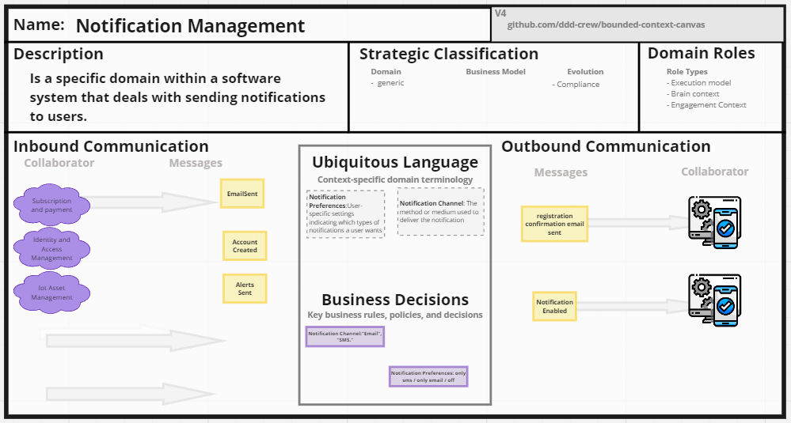

#### Profile Management
El siguiente Profile Management Bounded Context Canvas describe la gestión de información de perfil de los usuarios. Esto no solamente abarca los datos comunes de la cuenta, sino también las configuraciones de preferencias relacionadas con las notificaciones de las aplicaciones.

  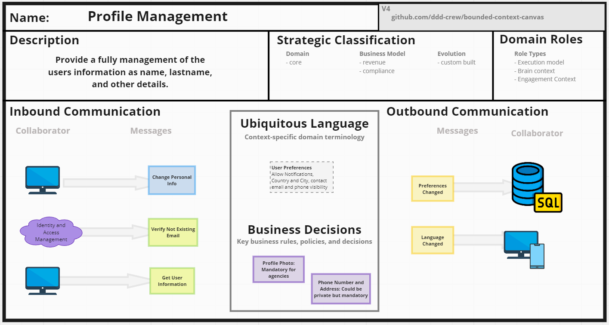

#### Transport Management
La siguiente imagen corresponde al Transport Bounded Context Canvas. Se puede observar a través de la aplicación web, las agencias de viaje podrán publicar los vehículos y gestionar su información al asignarlos a cada paquete turístico.

  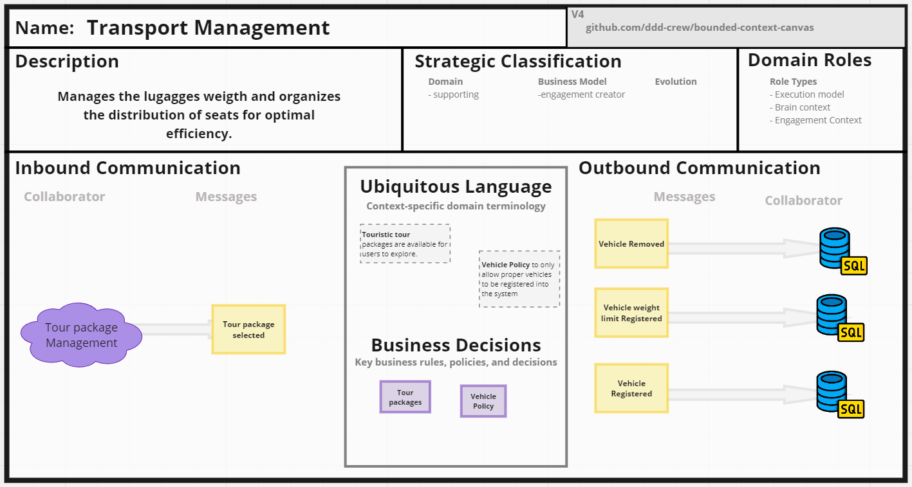

### 4.2.5. Context Mapping.
Después de obtener cuáles serían nuestros Bounded Contexts, se realizó la elaboración de las relaciones estructurales entre estos. Para ello, se tomó en cuenta posibles diseños candidatos para el Context Mapping, el cual se desarrolló considerando los patrones de relaciones entre Bounden Contexts establecidos en Domain-Driven Desgin, como Conformist, Customer/Supplier, Partnership o Shared Kernel. Se utilizó la herramienta online DomoRoboto para elaborar el Context Mapping de la siguiente imagen:

  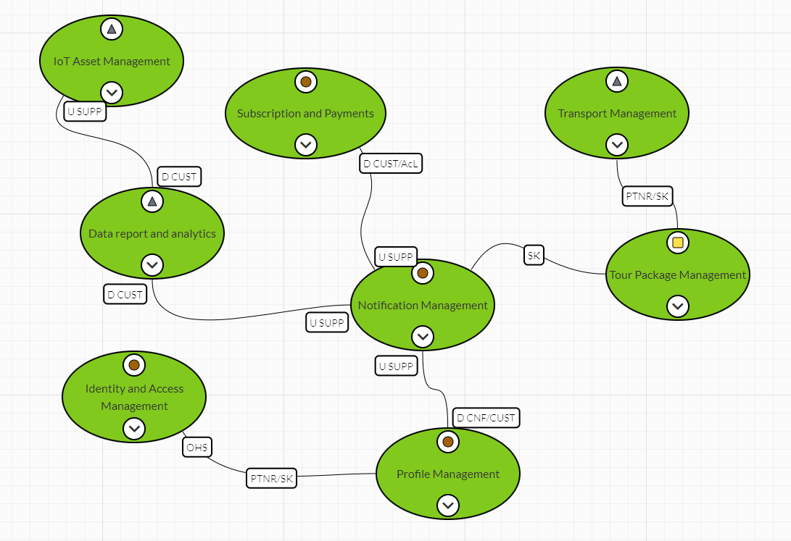

## 4.3. Software Architecture.
### 4.3.1. Software Architecture System Landscape Diagram.
Se realizó un System Landscape Diagram con el objetivo de visualizar una relación general entre el sistema interno, externos y los usuarios.

  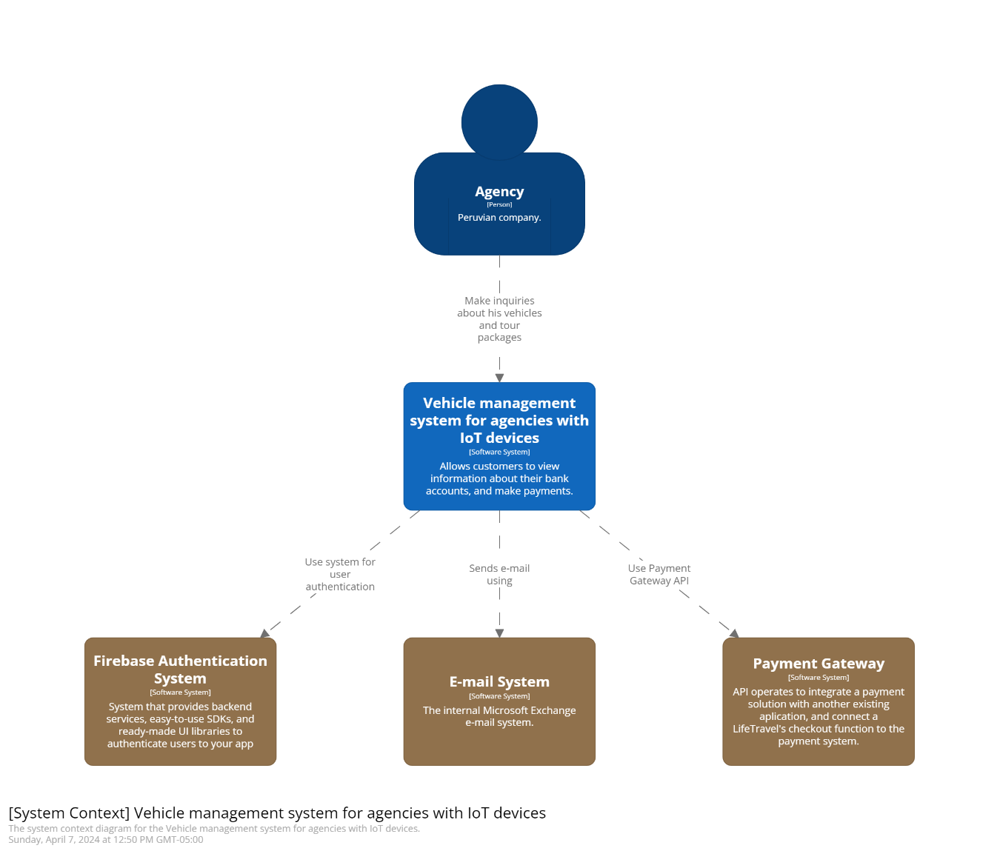

### 4.3.1. Software Architecture Context Level Diagrams.
Se realizó el primer nivel de Software Architecture, System Context en la herramienta Structurizr como se muestra en la siguiente imagen.

  

### 4.3.2. Software Architecture Container Level Diagrams.
Se realizó el segundo nivel de Software Architecture, Container, en la herramienta Structurizr como se muestra en la siguiente imagen.

  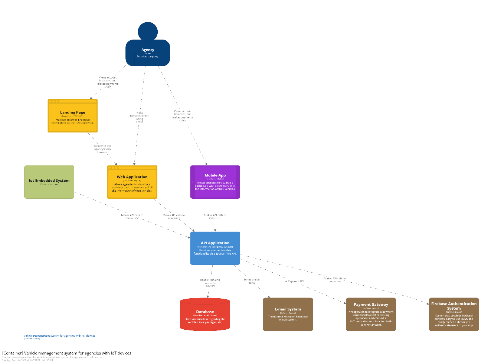

### 4.3.3. Software Architecture Deployment Diagrams.
Los diagramas de despliegue de software representan cómo los componentes de un sistema interactúan con la infraestructura. Son esenciales para la planificación y la gestión de sistemas de software. Por ello, se elaboró este diagrama como muestra la siguiente imagen.

  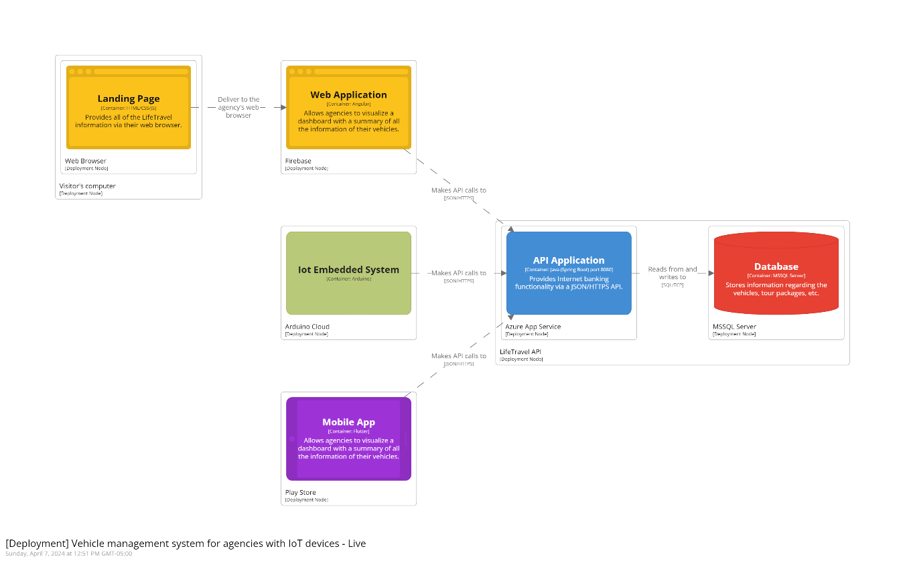

Link de Structurizr: https://structurizr.com/share/90706 

