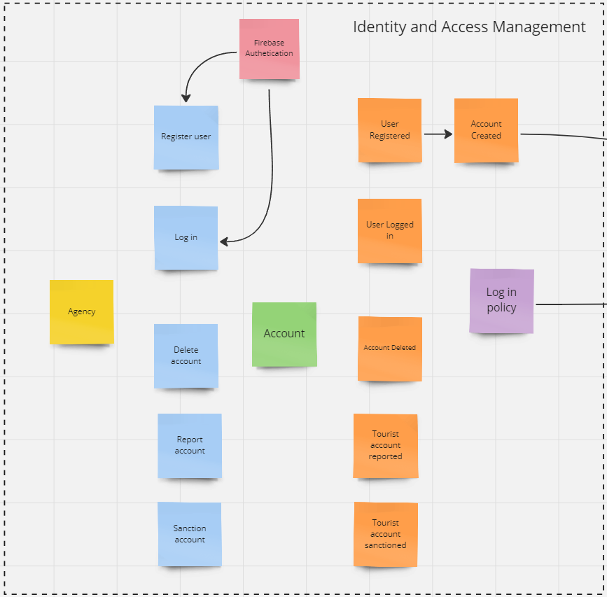
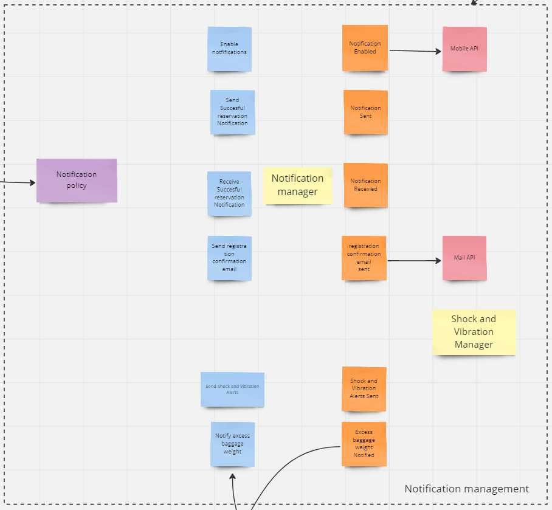

## 4.1. Strategic-Level Attribute-Driven Design

Strategic-Level Attribute-Driven Design
En esta sección, realizaremos el proceso de Attribute-Driven Design para abordar nuestra solución centrada en productos y tecnologías de Digital Transformation. Comenzaremos con una introducción seguida de un detallado análisis de los elementos y exploraremos el proceso de diseño, Inputs, Architectural Drivers, Design Decisions, Quality Attribute Scenarios and Initial High-Level Solution Architecture Views.

### 4.1.1. Design Purpose

El propósito fundamental del proceso de diseño de nuestra solución es optimizar y garantizar la seguridad y eficiencia en la gestión del equipaje de las agencias de tours. Buscamos transformar la manera en que las agencias gestionan y monitorean el equipaje de sus clientes, proporcionando una herramienta integral que permita un seguimiento en tiempo real, identificación y corrección automática de anomalías en el peso y condiciones de manejo del equipaje. Se tiene como objetivo satisfacer las necesidades de las agencias de tours al ofrecer una solución innovadora que mejore la experiencia de viaje de los pasajeros, cumpla con las regulaciones de transporte y seguridad, y optimice la operación y gestión de la agencia, impulsando así la confianza, seguridad y satisfacción del cliente.

## 4.1.2. Attribute-Driven Design Inputs.

### 4.1.2.1. Primary Functionality (Primary User Stories).

La siguiente tabla muestra las principales historias de usuarios que describen las funcionalidades principales de nuestro proyecto de software. Estas historias describen los deseos y objetivos principales de los usuarios y administradores, y son fundamentales para el éxito de la aplicación. A cada historia de usuario se le asigna una identificación única.

| **User Story ID** | **Título** | **Descripción** | **Criterios de Aceptación** | **Relacionado con (Epic ID)** |
| --- | --- | --- | --- | --- |
| US01 | Integración de Balanzas Inteligentes | Integrar balanzas inteligentes en los puntos de registro de equipaje para monitorear el peso del equipaje de los pasajeros en tiempo real. | SC01: Integración Exitosa  AC01: Balanza conectada  Dado que se ha instalado una balanza inteligente en el punto de registro de equipaje.  Cuando se inicie la conexión de la balanza a la plataforma.  Entonces la plataforma recibirá datos de peso en tiempo real de la balanza.  SC02: Alerta de Exceso de Peso  AC02: Peso dentro de límites  Dado que la plataforma está recibiendo datos de peso en tiempo real de la balanza.  Cuando el peso del equipaje está dentro de los límites establecidos.  Entonces no se generará ninguna alerta.  SC03: Alerta de Exceso de Peso  AC03: Peso excede límites  Dado que la plataforma está recibiendo datos de peso en tiempo real de la balanza.  Cuando el peso del equipaje excede los límites establecidos.  Entonces se generará una alerta automática de exceso de peso. | EP01 |
| US02 | Integración de Sensores de Impacto y Vibración | Integrar sensores de impacto y vibración en los compartimentos de almacenamiento del vehículo para detectar movimientos bruscos o golpes. | SC04: Integración Exitosa  AC04: Sensor conectado  Dado que se ha instalado un sensor de impacto y vibración en el compartimento de almacenamiento del vehículo.  Cuando se inicie la conexión del sensor a la plataforma.  Entonces la plataforma recibirá datos de movimientos y golpes en tiempo real.  SC05: Detección de Movimiento Brusco  AC05: Sin movimiento brusco  Dado que la plataforma está recibiendo datos de movimientos y golpes en tiempo real del sensor.  Cuando no se detecte ningún movimiento brusco o golpe.  Entonces no se generará ninguna alerta.  SC06: Detección de Movimiento Brusco  AC06: Movimiento brusco detectado  Dado que la plataforma está recibiendo datos de movimientos y golpes en tiempo real del sensor.  Cuando se detecte un movimiento brusco o golpe.  Entonces se generará una alerta automática de movimiento brusco. | EP01 |
| US07 | Notificaciones y Alertas Personalizadas | Enviar notificaciones y alertas personalizadas a los pasajeros sobre el estado y seguridad de su equipaje durante el viaje. | SC15: Reorganización de Carga  AC15: Carga reorganizada con éxito  Dado que el conductor recibe una alerta de exceso de peso.  Cuando el conductor reorganiza la carga del equipaje según las instrucciones de la alerta.  Entonces la carga se reorganiza con éxito y se confirma la acción realizada.  SC16: Reorganización de Carga  AC16: Carga no reorganizada  Dado que el conductor recibe una alerta de exceso de peso.  Cuando el conductor no reorganiza la carga del equipaje según las instrucciones de la alerta.  Entonces la carga no se reorganiza y se requiere confirmación. | EP03 |
| US12 | Funcionalidades de Reorganización de Carga | Permitir al conductor reorganizar la carga del equipaje en base a las alertas recibidas por exceso de peso. | SC22: Notificación de Estado de Equipaje  AC22: Notificación enviada  Dado que el pasajero necesita recibir notificaciones sobre el estado y seguridad de su equipaje.  Cuando se detecte una anomalía o incidente relacionado con el equipaje.  Entonces el pasajero recibirá una notificación clara y comprensible sobre el problema y las acciones tomadas. | EP03 |

### 4.1.2.2. Quality Attribute Scenarios

Estos escenarios ayudan a definir y comprender las expectativas y necesidades clave para la calidad del sistema. Los más cruciales se discutirán aquí.

| **Atributo** | **Fuente** | **Estímulo** | **Artefacto** | **Entorno** | **Respuesta** | **Medida** |
| --- | --- | --- | --- | --- | --- | --- |
| Seguridad | Plataforma de Gestión | Recepción de datos de peso excesivo | Plataforma de Gestión | Durante el transporte de equipaje | Generación de alerta automática de exceso de peso | Porcentaje de alertas generadas correctamente en casos de exceso de peso |
| Fiabilidad | Conductor | Recibir alerta de exceso de peso | Plataforma de Gestión | Durante el viaje | Capacidad del conductor para reorganizar la carga según la alerta | Porcentaje de alertas que resultan en una reorganización de carga exitosa |
| Usabilidad | Pasajero | Recibir notificaciones sobre el estado del equipaje | Aplicación de notificaciones | Durante el viaje | Claridad y comprensión de la notificación recibida por el pasajero | Porcentaje de notificaciones comprendidas por los pasajeros |
| Mantenibilidad | Equipo de desarrollo | Resolver errores en la plataforma | Plataforma de Gestión | Durante el mantenimiento | Tiempo requerido para resolver los errores identificados | Tiempo promedio de resolución de errores |
| Rendimiento | Plataforma de Gestión | Procesamiento de datos de equipaje | Plataforma de Gestión | Durante el monitoreo en tiempo real | Tiempo de respuesta para el procesamiento de datos de equipaje | Tiempo promedio de procesamiento de datos de equipaje |
| Escalabilidad | Plataforma de Gestión | Manejo de altos volúmenes de datos | Plataforma de Gestión | Durante períodos de alta demanda | Capacidad para escalar horizontalmente para manejar aumentos de carga | Número de instancias agregadas durante períodos de alta demanda |
| Seguridad | Plataforma de Gestión | Recepción de datos de peso excesivo | Plataforma de Gestión | Durante el transporte de equipaje | Generación de alerta automática de exceso de peso | Porcentaje de alertas generadas correctamente en casos de exceso de peso |
| Fiabilidad | Conductor | Recibir alerta de exceso de peso | Plataforma de Gestión | Durante el viaje | Capacidad del conductor para reorganizar la carga según la alerta | Porcentaje de alertas que resultan en una reorganización de carga exitosa |
| Usabilidad | Pasajero | Recibir notificaciones sobre el estado del equipaje | Aplicación de notificaciones | Durante el viaje | Claridad y comprensión de la notificación recibida por el pasajero | Porcentaje de notificaciones comprendidas por los pasajeros |

### 4.1.2.3. Constraints

Es fundamental durante el desarrollo de nuestro proyecto de software comprender e identificar explícitamente las restricciones que influirán en el diseño, la implementación y la operación del sistema. Cada uno de estos se discutirá en detalle a continuación.

| **Technical Story ID** | **Título** | **Descripción** | **Criterios de Aceptación** | **Relacionado con (Epic ID)** |
| --- | --- | --- | --- | --- |
| TUS001 | Plataforma de Desarrollo | La plataforma de desarrollo está restringida a tecnologías móviles como Kotlin para Android y Swift para iOS. | Dado que se ha establecido una restricción para utilizar exclusivamente tecnologías móviles como Kotlin para Android y Swift para iOS en la plataforma de desarrollo. | EP01, EP02, EP03 |
| TUS002 | Infraestructura Cloud | La infraestructura de la nube se limita a proveedores específicos como AWS y Google Cloud Platform (GCP). | Dado que se ha establecido una restricción para utilizar exclusivamente proveedores de nube como AWS y Google Cloud Platform (GCP) para la infraestructura de la plataforma. | EP01, EP02, EP03 |
| TUS003 | Seguridad de Datos | La seguridad de los datos debe cumplir con estándares como GDPR y regulaciones específicas del sector. | Dado que se requiere cumplir con estándares de seguridad de datos como GDPR y regulaciones del sector. | EP01, EP02, EP03 |
| TUS004 | Disponibilidad del Servicio | La plataforma debe garantizar una disponibilidad del servicio del 90% para mantener la confianza del cliente. | Dado que se ha establecido un objetivo de disponibilidad del servicio del 90% para la plataforma. | EP01, EP02, EP03 |
| TUS005 | Escalabilidad de la Plataforma | La plataforma debe ser capaz de escalar horizontalmente para manejar aumentos repentinos en la carga de usuarios. | Dado que se requiere que la plataforma pueda escalar horizontalmente para manejar aumentos de carga de manera efectiva. | EP01, EP02, EP03 |

## 4.1.3. Architectural Drivers Backlog

Siguiendo las secciones anteriores que abordaron los Functional Drivers, los Quality Attribute Drivers y todas los Constraints, se encontraron las siguientes variables determinantes. Esto se logró evaluando la implementación de la solución tecnológica.

| **Driver ID** | **Título** | **Descripción** | **Importancia para Stakeholders (High, Medium, Low)** | **Impacto en la Complejidad Técnica de la Arquitectura (High, Medium, Low)** |
| --- | --- | --- | --- | --- |
| AD01 | Experiencia del Usuario | Crear una interfaz de usuario intuitiva y atractiva para que las agencias de tours y los pasajeros puedan interactuar fácilmente con la plataforma de gestión de equipaje. | High | Medium |
| AD02 | Escalabilidad del Software | Garantizar que la plataforma pueda manejar aumentos repentinos en la carga de usuarios y dispositivos IoT, manteniendo un rendimiento óptimo y una experiencia sin interrupciones. | High | High |
| AD03 | Seguridad en los datos | Proteger la información confidencial relacionada con los datos de equipaje, las operaciones de las agencias de tours y la seguridad de los pasajeros mediante medidas de seguridad. | Medium | Medium |
| AD04 | Motor de Búsqueda por Presupuesto | Desarrollar un motor de búsqueda que permita a las agencias de tours y a los pasajeros encontrar paquetes de viaje según sus presupuestos y preferencias de manera eficiente. | High | High |
| AD05 | Asistente Virtual con Inteligencia Artificial | Implementar un asistente virtual con IA que pueda proporcionar recomendaciones personalizadas y asistencia en tiempo real tanto a las agencias como a los pasajeros. | High | High |
| AD06 | Reservas en la Aplicación | Permitir que los pasajeros reserven paquetes de viaje directamente a través de la aplicación móvil para una experiencia de reserva rápida, fácil y sin problemas. | High | High |

## 4.1.4. Architectural Design Decision

En esta sección, el proceso de toma de decisiones arquitectónicas se describirá en función de los quality attributes, los constraints arquitectónicas y los drivers especificados, con un resumen de los patrones y estrategias evaluados para cada iteración, así como los criterios utilizados para tomar decisiones de diseño.

**Driver ID:** AD01, Experiencia del Usuario

| **Táctica / Patrón** | **Pro** | **Con** |
| --- | --- | --- |
| Patrón MVC | La separación clara entre lógica y presentación permite una fácil adaptación de la interfaz. | Puede requerir más trabajo manual para actualizar las vistas cuando cambian los modelos. |
| Patrón MVVM | El binding bidireccional puede mejorar la interactividad y la reactividad de la interfaz. Facilita la creación de interfaces ricas y dinámicas. | Mayor complejidad en comparación con MVC debido al binding bidireccional. |

**Driver ID:** AD02, Escalabilidad del Software

| **Táctica / Patrón** | **Pro** | **Con** |
| --- | --- | --- |
| Modularidad | Modularidad que facilita la escalabilidad horizontal. | Puede ser menos eficiente en sistemas con muchas actualizaciones de vistas en tiempo real. |
| Patrón MVVM | Mejor para aplicaciones ricas en cliente con muchas actualizaciones dinámicas. Mayor overhead debido al binding bidireccional. | \-  |

**Driver ID:** AD03, Seguridad en los datos

| **Táctica / Patrón** | **Pro** | **Con** |
| --- | --- | --- |
| Controlador como Intermediario | El controlador actúa como un intermediario, lo que puede mejorar la seguridad al controlar qué datos se muestran. | Mayor riesgo si no se manejan adecuadamente las entradas/salidas. |

**Driver ID:** AD04, Motor de Búsqueda por Presupuesto

| **Táctica / Patrón** | **Pro** | **Con** |
| --- | --- | --- |
| Patrón MVC | Fácil de adaptar la lógica de búsqueda en el controlador. | La actualización de vistas puede no ser tan reactiva. |
| Patrón MVVM | Las búsquedas y filtros pueden reflejarse en tiempo real en la vista gracias al binding. | La lógica de filtrado puede estar más dispersa entre el ViewModel y el Modelo. |

**Driver ID:** AD05, Asistente Virtual con Inteligencia Artificial

| **Táctica / Patrón** | **Pro** | **Con** |
| --- | --- | --- |
| Patrón MVC | Clara separación de lógica de IA (modelo) y su presentación (vista). | La comunicación entre la vista y el modelo puede ser menos fluida. |
| Patrón MVVM | Mayor reactividad y actualizaciones en tiempo real en la interfaz de usuario. | La lógica del asistente puede estar dispersa entre ViewModel y Modelo, lo que puede complicar la implementación. |

**Driver ID:** AD06, Reservas en la Aplicación

| **Táctica / Patrón** | **Pro** | **Con** |
| --- | --- | --- |
| Modularidad | La lógica de reserva puede gestionarse de manera centralizada en el controlador. | Puede requerir más interacciones entre la vista y el controlador para actualizaciones. |
| Patrón MVVM | Las actualizaciones de estado de la reserva pueden reflejarse en tiempo real en la vista. | Puede haber más complejidad al manejar estados en el ViewModel. |

## 4.1.5. Quality Attribute Scenario Refinements

La siguiente sección enumera los escenarios priorizados para los quality attributes.

| **Scenario Refinement for US01: Integración de Balanzas Inteligentes** | **Scenario 1** |
| --- | --- |
| Scenario | Como usuario, quiero poder monitorizar el peso de mi equipaje en tiempo real durante el viaje |
| Business Goals | Satisfacción del cliente, funcionalidad principal |
| Relevant Quality Attribute | Fiabilidad y Desempeño |
| Scenario Components | Stimulus: Monitorización del peso del equipaje en tiempo real |
| | Stimulus Source: Plataforma de Gestión |
| | Environment: Durante el viaje |
| | Artifact (if known): Plataforma de Gestión |
| | Response: Actualización en tiempo real del peso del equipaje |
| | Response Measure: Actualización del peso del equipaje en menos de 1 segundo |
| Questions | ¿Cómo se garantiza la actualización en tiempo real del peso del equipaje? |
| Issues | Retrasos en la actualización del peso del equipaje durante el viaje |

| **Scenario Refinement for US01: Integración de Balanzas Inteligentes** | **Scenario 2** |
| --- | --- |
| Scenario | Como usuario, quiero recibir alertas automáticas si el peso de mi equipaje excede los límites establecidos |
| Business Goals | Seguridad del equipaje, funcionalidad principal |
| Relevant Quality Attribute | Seguridad y Fiabilidad |
| Scenario Components | Stimulus: Exceso de peso detectado |
| | Stimulus Source: Plataforma de Gestión |
| | Environment: Durante el transporte del equipaje |
| | Artifact (if known): Plataforma de Gestión |
| | Response: Generación automática de alertas si el peso del equipaje excede los límites establecidos |
| | Response Measure: Generación de alertas en menos de 1 segundo |
| Questions | ¿Cómo se garantiza la generación automática y oportuna de alertas en caso de exceso de peso del equipaje? |
| Issues | Fallos en la generación automática de alertas cuando se excede el límite de peso del equipaje |

| **Scenario Refinement for US02: Integración de Sensores de Impacto y Vibración** | **Scenario 1** |
| --- | --- |
| Scenario | Como usuario, quiero que se detecten y notifiquen los movimientos bruscos o golpes en el equipaje durante el viaje |
| Business Goals | Seguridad del equipaje, funcionalidad principal |
| Relevant Quality Attribute | Seguridad y Fiabilidad |
| Scenario Components | Stimulus: Movimientos bruscos detectados |
| | Stimulus Source: Sensores de Impacto y Vibración |
| | Environment: Durante el transporte del equipaje |
| | Artifact (if known): Plataforma de Gestión |
| | Response: Generación automática de alertas por movimientos bruscos o golpes en el equipaje |
| | Response Measure: Generación de alertas en menos de 1 segundo |
| Questions | ¿Cómo se garantiza la detección oportuna y precisa de movimientos bruscos o golpes en el equipaje durante el viaje? |

| **Scenario Refinement for US07: Funcionalidad de Reorganización de Carga** | **Scenario 1** |
| --- | --- |
| Scenario | Como conductor, quiero recibir alertas de exceso de peso para poder reorganizar la carga del vehículo y garantizar la seguridad durante el viaje. |
| Business Goals | Mejorar la seguridad y la eficiencia en la gestión del equipaje durante los tours. |
| Relevant Quality Attribute | Fiabilidad |
| Scenario Components | Stimulus: Recepción de alertas de exceso de peso. |
| | Stimulus Source: Plataforma de Gestión. |
| | Environment: Durante el viaje. |
| | Artifact (if known): Interfaz de usuario del conductor. |
| | Response: El conductor reorganiza la carga del vehículo según las alertas recibidas. |
| | Response Measure: Porcentaje de alertas que resultan en una reorganización de carga exitosa. |
| Questions | ¿Qué acciones tomará el conductor al recibir una alerta de exceso de peso? |
| Issues | Posibles problemas si las alertas no se entregan correctamente o si el conductor no puede reorganizar la carga a tiempo. |

| **Scenario Refinement for US12: Notificaciones y Alertas Personalizadas** | **Scenario 1** |
| --- | --- |
| Scenario | Como pasajero, quiero recibir notificaciones sobre el estado y seguridad de mi equipaje durante el viaje para estar informado y tranquilo. |
| Business Goals | Garantizar la comodidad y la tranquilidad de los pasajeros durante el viaje. |
| Relevant Quality Attribute | Usabilidad |
| Scenario Components | Stimulus: Detección de anomalías o incidentes relacionados con el equipaje. |
| | Stimulus Source: Plataforma de Gestión. |
| | Environment: Durante el viaje. |
| | Artifact (if known): Aplicación de notificaciones. |
| | Response: El pasajero recibe una notificación clara y comprensible sobre el problema y las acciones tomadas. |
| | Response Measure: Porcentaje de notificaciones comprendidas por los pasajeros. |
| Questions | ¿Cómo se asegura la claridad y comprensión de las notificaciones por parte de los pasajeros? |
| Issues | Posibles problemas si las notificaciones no se entregan o si no son comprensibles para los pasajeros. |

## 4.2. Strategic-Level Domain-Driven Design.

### 4.2.1. EventStorming.

Se abordó un enfoque colaborativo y visual que permitió modelar el contexto del dominio. Se exploraron las etapas de Candidate Context Discovery, Domain Message Flows Modeling y la creación de Bounded Context Canvases.

#### Unstructured Exploration

Se realizó la fase inicial en la que se exploraron ideas, conocimientos sobre el dominio del negocio. Así, se obtuvo las bases para el modelado de las siguientes etapas.

  

#### Pain points

Se identificaron las áreas problemáticas para la colaboración de sus soluciones y la implementación de mejoras que contribuyeron al flujo de trabajo.

  

#### Timelines

Hemos creado y gestionamos múltiples "timelines" para rastrear y coordinar nuestras actividades.

  

#### Pivotal points

Identificamos diversos "pivotal points" en nuestro proyecto para nuestra estrategia para alcanzar nuestros objetivos de manera más efectiva.

  

#### Commands

Estos jugaron un papel fundamental en la interacción y control de nuestro sistema al lograr las funcionalidades deseadas de manera eficiente.

  

#### Policies

Hemos desarrollado y aplicado diversas "policies" en nuestro sistema para establecer reglas en nuestras operaciones y procesos.

  

#### Read Models

Se gestionaron varios los "read models" en nuestro sistema para proporcionar vistas optimizadas de nuestros datos almacenados.

  

#### External Systems

Se identificaron los sitemas externos necesarios para la implementación de nuestro proyecto. Estos nos prooveran fuentes externas de datos o servicios.

  

#### Aggregates

Se analizó cuáles son las entidades y conceptos que tienen un significado específico en el contexto del dominio.

  

#### Bounded Contexts

Hemos identificado varios "bounded contexts" en nuestro proyecto para delimitar claramente las áreas funcionales y definir límites precisos entre los distintos componentes del sistema.

  

Link de EventStorming: https://miro.com/app/board/uXjVKX3-eW8=/?share_link_id=683824060622

### 4.2.2. Candidate Context Discovery.

Empleando la metodología de eventstorming con enfoque en la técnica de "start-with-simple", utilizamos la línea de tiempo para identificar posibles candidatos para nuestro contexto delimitado, los cuales son los siguientes:

#### Profile management

En este Bounded Context están los eventos y comandos relacionados a la gestión del perfil de nuestros dos tipos de usuarios: agencias de viajes y turistas. Asismismo, se encuentran los eventos de configuraciones generales de nuestras aplicaciones.

  

#### Identity and Access Management

En el presente Bounded Context están los comandos que están relacionados a la gestión de la autenticación de los usuarios en nuestras aplicaciones web y móvil. En este se detalla que usaremos un sistema externo llamado Firebase Authentication para nuestras dos aplicaciones.

  

#### Iot Asset management

Para este Bounded Context, nos enfocamos en crear los comandos que serán útiles para el mantenimiento de nuestros dispositivos Iot, tales como: Schock and Vibration Sensors and Smart Scales.

  

#### Notification management

En este Bounded Context están esencialmente los eventos y comandos para la gestión de notificaciones, ya sea por correo o a los dispositivos móviles de nuestros usuarios.

  

#### Subscription and payments

En este Bounded Context, se empleará un sistema externo de Pasarela de Pagos para realizar los pagos de las suscripciones y los paquetes turísticos seleccionados que deben abonarse. También, están los comandos para el mantenimiento de las subscripciones que los usuarios agencias de tours adquirirán.

  

#### Tour Package Management

En el presente Bounded Context, los usuarios agencias de viaje podrán crear, modificar y eliminar los paquetes turísticos que asociarán a los vehículos.

  

#### Transportation Management

En el presente Bounded Context, los usuarios agencias de viaje podrán crear, modificar y eliminar vehículos y asignarlos para cada tour registrado en la aplicación web. De igual manera, podrán visualizar la información de los transportes relacionada con el tour.

  

#### Data report and analytics

El Bounded Context "Data Report and Analytics" desempeña un papel fundamental en el análisis y la interpretación de datos tales como las reasignaciones de vehículos por exceso de peso de equipaje, satisfacción de los turistas a los paquetes turísticos, reportes sobre la cantidad de anomalías del clima de los lugares de los tours, entre otros.

  

### 4.2.3. Domain Message Flows Modeling.

Durante este procedimiento, se detectaron los participantes, mensajes que se comparten y se delinean en las corrientes de información que enlazan estos componentes.

#### Scenario: Registering in the app

En el siguiente flujo se muestra cómo nuestros usuarios, tanto turistas como agencias, pueden registrarse en nuestra aplicación. Primero, pasarán por nuestro aplicación web, que registrará los datos requeridos en un sistema externo, respectivamente. Finalmente, recibirán una notificación a través del correo electrónico.

  

#### Scenario: Register a tour package

En este escenario, la agencia registra un paquete turístico, y nuestro sistema se encarga de almacenarlo en la base de datos con un ID para facilitar su identificación en el futuro de manera sencilla.

  

#### Scenario: Pay a Subscription

En este escenario, las agencias utilizan nuestra aplicación web para suscribirse a uno de nuestros planes. Cuando desean realizar el pago, nuestro sistema consulta el estado del mismo a través de un sistema externo. Una vez confirmado el pago, se asigna la suscripción a su cuenta. Además, se notificará a la agencia sobre el estado final de la compra.

  

#### Scenario: Register a Vehicle

En este escenario, las agencias registran un medio de transporte utilizando nuestra aplicación web. El sistema se encarga de realizar las asignaciones correspondientes, lo que permite una gestión eficiente de los recursos de transporte disponibles para satisfacer las necesidades de los viajes turísticos.

  

#### Scenario: Assign a vehicle for a Tour Package

En este escenario, se describe el proceso en el cual las agencias de viaje, utilizando nuestra aplicación web, asignan un medio de transporte, previamente registrado, a un paquete turístico. Esta asignación facilita la planificación y organización de los viajes, garantizando que el sistema tenga la información de los vehículos asignados y se pueda reorganizar.

  

#### Scenario: Reassign a vehicle for excess weight limit

En este escenario, se muestra el flujo cuando a través de nuestros dispositivos IoT se detecta un exceso de peso que supera el límite permitido para el vehículo asignado. Después de esta detección, se notifica a la agencia mediante nuestra aplicación web, y finalmente se procede a la reasignación de un vehículo de transporte para ese paquete turístico.

  

#### Scenario: Notify shock and vibration alert

Cuando alguno de los sensores colocados en los equipajes de los vehículos detecta una anomalía, ya sea impacto o mucha vibración, se envía una alerta a la agencia.

  

### 4.2.4. Bounded Context Canvases.

#### Data Report and Analytics

En este Canvas se obtendrá y analizará la información que devuelva los dispositivos Iot, ya sean las balanzas inteligentes, sensores. Este Bounded Context estará relacionado con los Bounded Context Iot Asset Management y Notification Management.

  

#### IoT Asset Management

La siguiente imagen corresponde al IoT Asset Management Bounded Context Canvas. Se puede observar que la información proporcionada de los dispositivos Iot se envía al Bounded Context de Notification Management.

  

#### Identity And Access Management

En el siguiente Canvas, describe la comunicación que usaremos con los sistemas externos de autenticación para el registro e ingreso de los usuarios a nuestras aplicaciones web y móvil. Este Bounded Context estará relacionado con los Bounded Context Profile Management y Notification Management.

  

#### Subscription and payments

La siguiente imagen corresponde al Subscription and payments Context Canvas. Este gestiona la información de la compra de las subscripciones de las agencias en la aplicación web.

  

#### Notification Management

En este Bounded Context Canvas, se puede visualizar la comunicación que tendrá con la mayoría de Bounded Context. Este estará encargado de enviar mensajes de alertas, correos, notificaciones a los usuarios sobre los cambios de estados de reservas, paquetes turísticos, recomendaciones climáticas, entre otros.

  

#### Profile Management

El siguiente Profile Management Bounded Context Canvas describe la gestión de información de perfil de los usuarios. Esto no solamente abarca los datos comunes de la cuenta, sino también las configuraciones de preferencias relacionadas con las notificaciones de las aplicaciones.

  

#### Transport Management

La siguiente imagen corresponde al Transport Bounded Context Canvas. Se puede observar a través de la aplicación web, las agencias de viaje podrán publicar los vehículos y gestionar su información al asignarlos a cada paquete turístico.

  

### 4.2.5. Context Mapping.

Después de obtener cuáles serían nuestros Bounded Contexts, se realizó la elaboración de las relaciones estructurales entre estos. Para ello, se tomó en cuenta posibles diseños candidatos para el Context Mapping, el cual se desarrolló considerando los patrones de relaciones entre Bounden Contexts establecidos en Domain-Driven Desgin, como Conformist, Customer/Supplier, Partnership o Shared Kernel. Se utilizó la herramienta online DomoRoboto para elaborar el Context Mapping de la siguiente imagen:

  

## 4.3. Software Architecture.

### 4.3.1. Software Architecture System Landscape Diagram.

Se realizó un System Landscape Diagram con el objetivo de visualizar una relación general entre el sistema interno, externos y los usuarios.

  

### 4.3.1. Software Architecture Context Level Diagrams.

Se realizó el primer nivel de Software Architecture, System Context en la herramienta Structurizr como se muestra en la siguiente imagen.

  

### 4.3.2. Software Architecture Container Level Diagrams.

Se realizó el segundo nivel de Software Architecture, Container, en la herramienta Structurizr como se muestra en la siguiente imagen.

  

### 4.3.3. Software Architecture Deployment Diagrams.

Los diagramas de despliegue de software representan cómo los componentes de un sistema interactúan con la infraestructura. Son esenciales para la planificación y la gestión de sistemas de software. Por ello, se elaboró este diagrama como muestra la siguiente imagen.

  

Link de Structurizr: https://structurizr.com/share/90706

