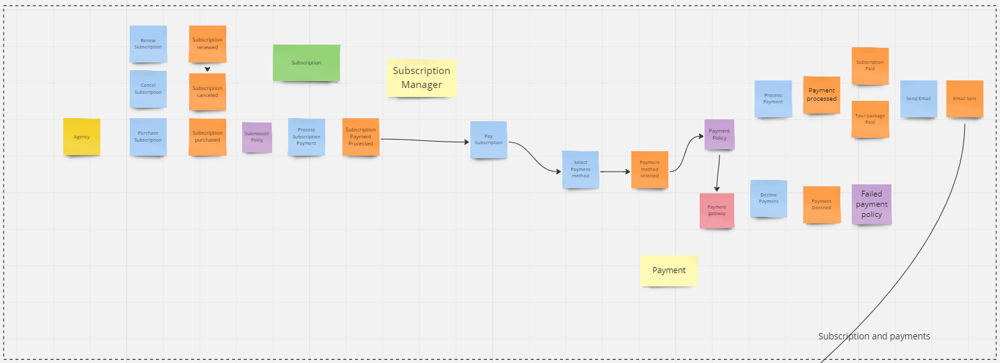

## 4.1. Strategic-Level Attribute-Driven Design
### 4.1.1. Design Purpose

## 4.1.2. Attribute-Driven Design Inputs.
### 4.1.2.1. Primary Functionality (Primary User Stories).

### 4.1.2.2. Quality attribute Scenarios.
### 4.1.2.3. Constraints

### 4.1.3. Architectural Drivers Backlog

### 4.1.4 Architectural Design Decision
### 4.1.5. Quality Attribute Scenario Refinements.

## 4.2. Strategic-Level Domain-Driven Design.

### 4.2.1. EventStorming.
Se abordó un enfoque colaborativo y visual que permitió modelar el contexto del dominio. Se exploraron las etapas de Candidate Context Discovery, Domain Message Flows Modeling y la creación de Bounded Context Canvases.

#### Unstructured Exploration
Se realizó la fase inicial en la que se exploraron ideas, conocimientos sobre el dominio del negocio. Así, se obtuvo las bases para el modelado de las siguientes etapas.

  

#### Pain points
Se identificaron las áreas problemáticas para la colaboración de sus soluciones y la implementación de mejoras que contribuyeron al flujo de trabajo.

  

#### Timelines
Hemos creado y gestionamos múltiples "timelines" para rastrear y coordinar nuestras actividades. 

  

#### Pivotal points
Identificamos diversos "pivotal points" en nuestro proyecto para nuestra estrategia para alcanzar nuestros objetivos de manera más efectiva.

  

#### Commands
Estos jugaron un papel fundamental en la interacción y control de nuestro sistema al lograr las funcionalidades deseadas de manera eficiente.

  

#### Policies
Hemos desarrollado y aplicado diversas "policies" en nuestro sistema para establecer reglas en nuestras operaciones y procesos.

  

#### Read Models
Se gestionaron varios los "read models" en nuestro sistema para proporcionar vistas optimizadas de nuestros datos almacenados.

  

#### External Systems
Se identificaron los sitemas externos necesarios para la implementación de nuestro proyecto. Estos nos prooveran fuentes externas de datos o servicios.

  

#### Aggregates
Se analizó cuáles son las entidades y conceptos que tienen un significado específico en el contexto del dominio.

  

#### Bounded Contexts
Hemos identificado varios "bounded contexts" en nuestro proyecto para delimitar claramente las áreas funcionales y definir límites precisos entre los distintos componentes del sistema.

  

Link de EventStorming: https://miro.com/app/board/uXjVKX3-eW8=/?share_link_id=683824060622

### 4.2.2. Candidate Context Discovery.
Empleando la metodología de eventstorming con enfoque en la técnica de "start-with-simple", utilizamos la línea de tiempo para identificar posibles candidatos para nuestro contexto delimitado, los cuales son los siguientes:

#### Profile management
En este Bounded Context están los eventos y comandos relacionados a la gestión del perfil de nuestros dos tipos de usuarios: agencias de viajes y turistas. Asismismo, se encuentran los eventos de configuraciones generales de nuestras aplicaciones.

  

#### Identity and Access Management
En el presente Bounded Context están los comandos que están relacionados a la gestión de la autenticación de los usuarios en nuestras aplicaciones web y móvil. En este se detalla que usaremos un sistema externo llamado Firebase Authentication para nuestras dos aplicaciones.

  

#### Iot Asset management
Para este Bounded Context, nos enfocamos en crear los comandos que serán útiles para el mantenimiento de nuestros dispositivos Iot, tales como: Schock and Vibration Sensors and Smart Scales.

  

#### Notification management
En este Bounded Context están esencialmente los eventos y comandos para la gestión de notificaciones, ya sea por correo o a los dispositivos móviles de nuestros usuarios.

  

#### Subscription and payments
En este Bounded Context, se empleará un sistema externo de Pasarela de Pagos para realizar los pagos de las suscripciones y los paquetes turísticos seleccionados que deben abonarse. También, están los comandos para el mantenimiento de las subscripciones que los usuarios agencias de tours adquirirán.

  

#### Tour Package Management
En el presente Bounded Context, los usuarios agencias de viaje podrán crear, modificar y eliminar los paquetes turísticos que asociarán a los vehículos.

  

#### Transportation Management
En el presente Bounded Context, los usuarios agencias de viaje podrán crear, modificar y eliminar vehículos y asignarlos para cada tour registrado en la aplicación web. De igual manera, podrán visualizar la información de los transportes relacionada con el tour.

  

#### Data report and analytics
El Bounded Context "Data Report and Analytics" desempeña un papel fundamental en el análisis y la interpretación de datos tales como las reasignaciones de vehículos por exceso de peso de equipaje, satisfacción de los turistas a los paquetes turísticos, reportes sobre la cantidad de anomalías del clima de los lugares de los tours, entre otros.

  

### 4.2.3. Domain Message Flows Modeling.
### 4.2.4. Bounded Context Canvases.
### 4.2.5. Context Mapping.
## 4.3. Software Architecture.
### 4.3.1. Software Architecture System Landscape Diagram.
### 4.3.1. Software Architecture Context Level Diagrams.
### 4.3.2. Software Architecture Container Level Diagrams.
### 4.3.3. Software Architecture Deployment Diagrams.

