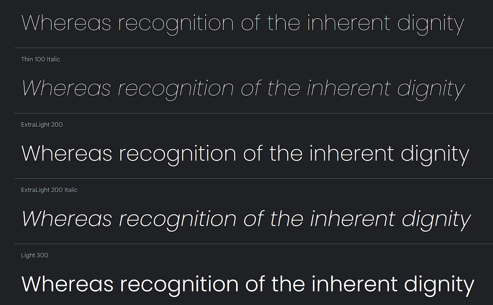
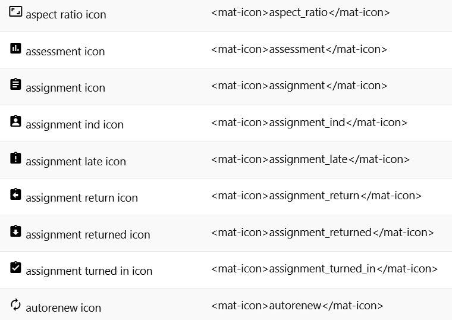
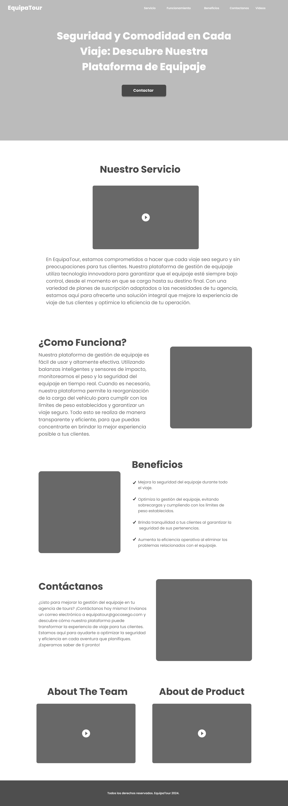
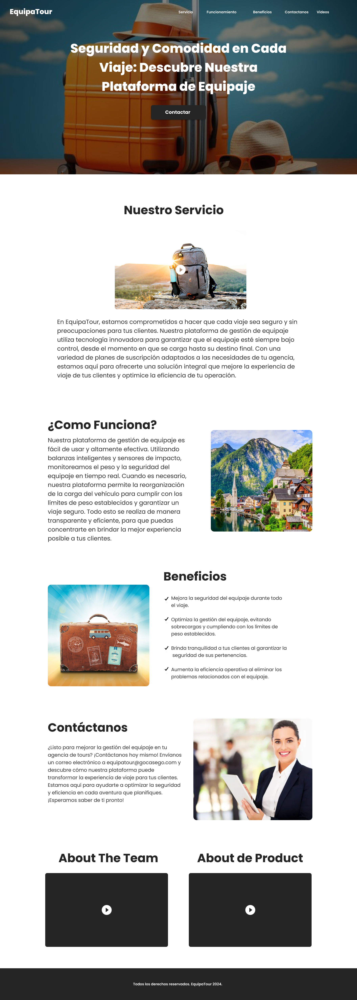

# Capítulo VI: Solution UX Design.

## 6.1. Style Guidelines.
En este punto se abordarán las directrices que nuestra startup utilizará para presentar de manera uniforme y efectiva nuestros productos.
### 6.1.1. General Style Guidelines.
A continuación, se presentan las pautas generales para asegurar una presentación coherente de nuestros productos.
#### Branding
En esta sección, detallaremos cómo se deben utilizar nuestros logotipos y elementos visuales para transmitir nuestra visión de desarrollo sostenible y enriquecimiento de las comunidades. A continuación, se muestra nuestro logo:


#### Typography
Aquí, definimos las tipografías que reflejan nuestra identidad y proporcionaremos pautas sobre tamaños y estilos de fuente para garantizar una presentación coherente en todas nuestras comunicaciones escritas.

La tipografía utilizada será Poppins, que incluye las variantes Regular, Medium, Semi-Bold y Bold. El tamaño de la letra varió entre 1 rem (16 px), 1.5 rem (24 px), 2 rem (32 px) y 3 rem (48 px)." Asimismo, para los iconos utilizaremos los iconos de Angular Material.

**Poppins - Google fonts**



Referencia:  https://fonts.google.com/specimen/Poppins

**Mat - icons**



Referencia: https://www.angularjswiki.com/angular/angular-material-icons-list-mat-icon-list/ 
#### Colors
En esta sección, especificamos los colores de nuestra paleta y cómo se deben aplicar en diferentes contextos, asegurando que nuestra marca sea reconocible y atractiva.

Hesterbeg, menciona que es vital definir una paleta de colores que contribuya a crear una apariencia y sensación consistente para la marca (2022).
El equipo ha seleccionado una paleta de colores que consta de los siguientes elementos:

- **Primary**: Este color se utilizará para las barras superiores e inferiores de la aplicación. Coincidirá con el tono predominante en el logotipo de la empresa. El código HEX seleccionado es #10141E, y su equivalente en RGB es 16, 20, 30.


- **Primary Variant**: Para teñir la barra de notificaciones, emplearemos una variación del color principal. Es el color HEX #161D2F, que en RGB se expresa como 22, 29, 47.


- **Secondary**: Los botones flotantes de la aplicación se resaltarán con este color. Para este propósito, hemos seleccionado el código HEX seleccionado es #FC4747, y su equivalente en RGB es 252, 71, 71.


- **Background**: Este color será el fondo general de la aplicación. En este caso, utilizaremos un tono oscuro con el código HEX seleccionado es #10141E, y su equivalente en RGB es 16, 20, 30.


- **Surface**: Los contenedores de publicaciones de empresas o al revisar perfiles de choferes se complementarán con este color. Igualmente, hemos optado por el código HEX #5A698F, que en RGB se traduce como 90, 105, 143.


- **Error**: Cuando el usuario realice una operación incorrecta o ingrese datos erróneos, se mostrará este color. El color seleccionado para estas situaciones es el amarillo con el código HEX #FFD700, y su equivalente en RGB es 255, 215, 0.


- **Colores "On"**: Estos colores se utilizan para letras, números, símbolos, etc., según el contexto. Para los apartados Primary, Secondary, Background y Surface, emplearemos el color negro con el código HEX #000000, que en RGB se representa como 0, 0, 0. En cuanto al apartado Error, utilizaremos el color blanco con el código HEX #FFFFFF, que en RGB es 255, 255, 255.


#### Spacing
- **Botones**: Establecemos un margen interior (padding) de 1 rem (16 px) en la dirección vertical y de 2 rem (32 px) en la horizontal.
- **Márgenes entre texto**: Mantenemos un margen de 1 rem (16 px) entre elementos de texto.
- **Márgenes entre elementos**: Garantizamos un margen de 1.5 rem (24 px) entre distintos elementos.
- **Márgenes entre secciones**: Fijamos un margen de 6 rem (72 px) para separar claramente las diferentes secciones de contenido.

### 6.1.2. Web, Mobile and IoT Style Guidelines.
#### Web Style Guidelines
En nuestras pautas de estilo web, priorizamos la adaptación de nuestros principios de diseño a la experiencia de usuario en entornos de navegación en línea. Esto incluye:
- **Diseño Responsivo**: Establecemos directrices para la adaptación de la interfaz a diferentes tamaños de pantalla, como los formatos 16:9, desde computadoras de escritorio hasta tabletas. Garantizamos que la experiencia de usuario sea óptima en diversos dispositivos.
- **Navegación**: Para una navegación intuitiva, utilizaremos una barra de navegación (Navbar) para organizar los menús. Además, como parte de las prácticas de diseño responsivo, implementaremos un "Botón hamburguesa" en el menú para facilitar la navegación en pantallas más pequeñas.


#### Mobile Style Guidelines
Para nuestra versión móvil, nos enfocamos en optimizar la experiencia en dispositivos móviles, asegurando una interfaz eficiente y amigable para el usuario. Esto incluye:
- **Diseño de Pantalla**: Definimos la disposición de elementos en pantallas más pequeñas, considerando proporciones específicas para Android y iOS, para garantizar una usabilidad efectiva y una navegación sencilla.
- **Adaptación de Contenido**: Ofrecemos recomendaciones para adaptar y priorizar el contenido en dispositivos móviles, manteniendo su relevancia y utilidad, y asegurando una experiencia de usuario coherente en diferentes sistemas operativos móviles.
- **Compatibilidad de Dispositivos**: Aseguramos que la aplicación móvil sea compatible con una amplia variedad de dispositivos y sistemas operativos móviles, abarcando tanto Android como iOS.


#### IoT Style Guidelines
Nuestras pautas de estilo para dispositivos IoT, como la balanza inteligente con pantalla, se centran en la interfaz limitada y la comunicación de datos. Incluyen:
- **Interfaz de Pantalla (balanza inteligente)**: Detallamos el diseño de la pantalla de la balanza, enfocándonos en la legibilidad y presentación efectiva del peso de las maletas. Proporcionamos ejemplos con dimensiones en píxeles para las celdas de la pantalla.
- **Sensores de Impacto y Vibración**: En este caso los guidelines no aplican, porque la información de los sensores de impacto y vibración se obtendrá mediante endpoints, asegurando una recopilación y transmisión segura de datos. Entonces, no se requiere una interfaz de usuario para esto.

## 6.2. Information Architecture.
### 6.2.1. Organization Systems.
Establecer una jerarquía visual clara es fundamental para la creación de una página web altamente optimizada. Esto se debe a la forma en que nuestros sistemas visuales están interconectados; tenemos la tendencia natural de escanear y procesar rápidamente diversos elementos visuales, como bordes, contrastes, tamaños y movimientos, para evaluar y comprender nuestro entorno. A continuación, se presentarán algunos ejemplos de la jerarquía visual que está previsto implementar en nuestras aplicaciones.

El flujo que deseamos que los usuarios experimenten al ingresar a la aplicación se describe de la siguiente manera:

- En primer lugar, el usuario será recibido con un dashboard con la información de los equipajes, como la masa y el estado, cada uno representado en una tarjeta individual.

- A continuación, el usuario tendrá acceso a una barra lateral donde encontrará una serie de opciones adicionales, como las capacitaciones, el historial de reservas, etc.

- Asimismo, se proporcionará al usuario la opción de ordenar los equipajes según varios criterios, como precio, calificación, orden alfabético, entre otros.


### 6.2.2. Labeling Systems.
En esta sección, vamos a presentar el sistema de etiquetado que proporcionará una descripción concisa y clara de la información presentada en cada una de nuestras aplicaciones. Comenzaremos detallando los encabezados que estarán disponibles en nuestra landing page.

  - **Inicio/Home:** Esta sección preseleccionada por defecto ofrecerá una breve descripción que representará la aplicación y proporcionará una idea del objetivo principal de esta.

- **Conócenos/About Us:** En esta sección, los clientes podrán obtener información sobre nuestro equipo, ver nuestra misión, visión, conocer quiénes somos y qué hacemos.

- **Servicios/Services:** La sección de caracteristicas se encuentra dividida en segmentos objetivos, donde mostraremos los beneficios que nuestro sistema ofrece para cada uno de ellos.

- **Planes**: Aquí se presentarán los montos promedio a pagar.

### 6.2.3. Searching Systems.

Los Searching Systems se han diseñado utilizando un lenguaje claro y formal, que al mismo tiempo es fácil de comprender. Aquí se enumeran los que tendrá nuestra aplicación:

- Búsqueda de equipajes: Se encontrará en el dashboard, que es la pantalla principal, en donde se muestra la información de cada equipaje.
- Búsqueda de Reservas: Se encontrará en la sección de historial de reservas.

### 6.2.4. SEO Tags and Meta Tags
Los meta tags que serán incorporados son los siguientes:

Encabezado: Estrictamente hablando, esto no es un meta-tag, sino una etiqueta independiente de HTML. Sin embargo, es válido considerarlo como parte de la información metadatos. Esta etiqueta debe tratarse como un elemento esencial en el encabezado del documento HTML, ya que se encarga de proporcionar el título de la página web. Su importancia radica en que los motores de búsqueda más prominentes utilizan esta etiqueta para titular las entradas en sus resultados.

Descripción: En este campo, podemos ofrecer una descripción breve y concisa del contenido del sitio web. Esta información es la que se muestra como un fragmento (síntesis que aparece debajo de la URL) en los motores de búsqueda más comunes, como Google.

Keywords: Aquí tenemos la opción de definir Keywords para el motor de búsqueda. En su momento de mayor auge, esta etiqueta meta se utilizaba en los motores de búsqueda primitivos para el posicionamiento de resultados de búsqueda. Por lo tanto, se consideró uno de los factores de SEO más relevantes.

Autor y Derechos de Autor: Estas dos etiquetas meta hacen referencia al diseñador de una página web y al propietario de los derechos de autor del código fuente de la página HTML.


Landing Page:
• Título:
- **Título:**
```html
<title>
GoCaseGo | Conoce la mejor aplicación para administración de equipajes
</title>
```

- Descripción:
```
  
 <meta name="description" content="Los equipajes de tus clientes viajarán seguro con nosotros"/>

```

- Palabras clave:
```

<meta name="keywords" content="Viajes, Paquetes de viajes, Tours, Tour Packages, precios, tarifas"/>
```

• Autor:
```

<meta name="author" content="EquipaTour" />

```

- Copyright:
```

<meta name="copyright" content="© EquipaTour, 2024" />

```

### 6.2.5. Navigation Systems.

Proponemos un sistema de navegación que permita al usuario una experiencia intuitiva y fluida a través de la aplicación. Se utilizará una barra de navegación en la parte superior de la pantalla que incluirá las siguientes secciones:

- **Notificaciones:** Aquí el usuario podrá recibir alertas en tiempo real de alguna incidencia detectada por los sensores.

- **Mi cuenta:** Aquí el usuario podrá ver su perfil, datos de inicio de sesión, entre otros.

Adicional a ello, se tendrá una barra lateral (desplegable en las versiones de pantalla más pequeñas), que contendrá lo siguiente:

- **Dashboard:** Esta sección llevará al usuario a la pantalla principal de la aplicación, donde podrá acceder a toda la información sobre los equipaje de sus clientes.

- **Capacitaciones:** En esta sección, el usuario podrá acceder a las guías y videos que lo ayudarán a realizar un correcto uso de los sensores y la aplicación en conjunto.

- **Historial de Reservas:** Esta sección permitirá al usuario explorar la lista de reservas realizadas por sus clientes en el tiempo.

## 6.3. Landing Page UI Desing.
## 6.3.1 Landing Page Wireframe.


## 6.3.2 Laning Page Wireflow.


## 6.4. Applications UX/UI Design.

### 6.4.1. Applications Wireframes.
En el diseño de nuestras aplicaciones, los wireframes juegan un papel fundamental al ayudarnos a organizar la interfaz y la navegación antes de comenzar el desarrollo. En nuestro proyecto, optamos por utilizar 'Figma' para elaborar los wireframes de manera eficaz y con la posibilidad de colaboración.

A continuación, mostramos los wireframes de nuestra aplicación web.

<div align="center">
    
</div>

### 6.4.2. Applications Wireflow Diagrams.

A continuación, se presentan los wireflows.

User goal: Primero se registra el usuario en el web o inicia sesión. Luego el usuario puedo interactuar los dashboard para ver el estado de un equipaje, ver las capacitaciones y consultar el historial de reservas. Por último estas serán notificadas por la web cuando encuentren un cambio.

<div align="center">
    
</div>